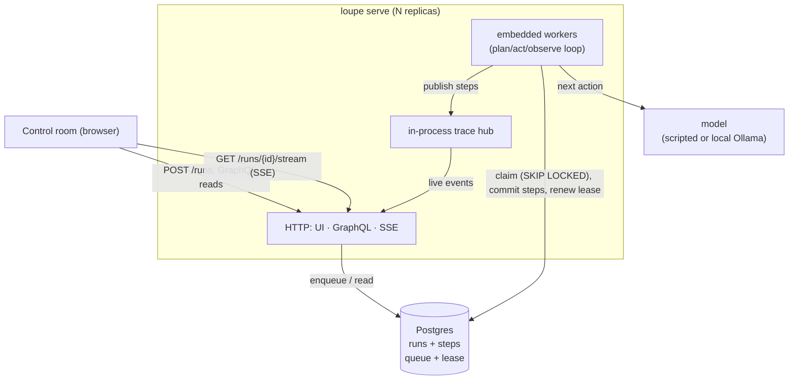
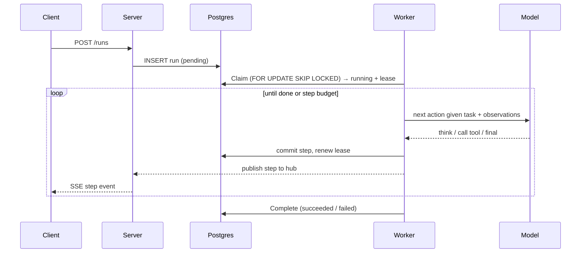

# Architecture

Loupe runs AI agents and makes every step visible, durable, and replayable. The
design goal is that a run is a first-class, persisted thing: it survives a crash,
many workers can share the load, and anyone can watch it live or replay it later.

## The pieces

- **Run engine** (`internal/agent`): the plan / act / observe loop. It asks the
  model for the next action, dispatches the tool, feeds the result back, and
  repeats. A tool error is an observation the agent recovers from, not a failure.
- **Model boundary** (`internal/model`): a three-method interface. A deterministic
  scripted model backs tests and the offline demo; an Ollama model drives real
  local runs. Talking to a local model is plain HTTP, so no heavy SDK.
- **Store** (`internal/store`): a queue and a step log at once, behind one
  interface with an in-memory and a Postgres implementation.
- **Trace** (`internal/trace`): every step is published as an event; a per-run hub
  fans it to any number of watchers and keeps history for replay.
- **Server** (`internal/server`, `internal/gql`): the control room UI, a GraphQL
  federation subgraph for typed reads, and an SSE endpoint for the live stream.

## The run lifecycle

## Durability and resume

Every step is committed to Postgres before the run advances. A worker holds a
**lease** it renews on each committed step. If the worker dies, the lease stops
advancing; once it expires, `Claim` treats the run as reclaimable and another
worker picks it up. Resume rebuilds the observation history from the stored steps
and continues after the last committed step, so **committed side effects are never
redone**. This is why the resume test can assert the fix is written exactly once
across a crash.

## Why the transport is split

Typed, low-rate reads (look a run up, list runs) go through **GraphQL**, which also
makes `Run` a federation entity a supergraph can stitch. The high-rate live step
stream does **not** go through GraphQL; it streams over **SSE**. This is the same
reason you would not push a 60fps feed through a GraphQL subscription, and it means
the federated read schema stays clean while the hot path stays cheap.

## Scaling

Workers are stateless and share one queue, so the unit of scale is the worker
replica. Under saturating load, 1 to 4 replicas is a 6x throughput gain and cuts
p95 latency from 7.8s to 1.2s. Past that the single Postgres run store becomes the
ceiling. See `loadtest/RESULTS.md` for the numbers and the honest bottleneck read.
