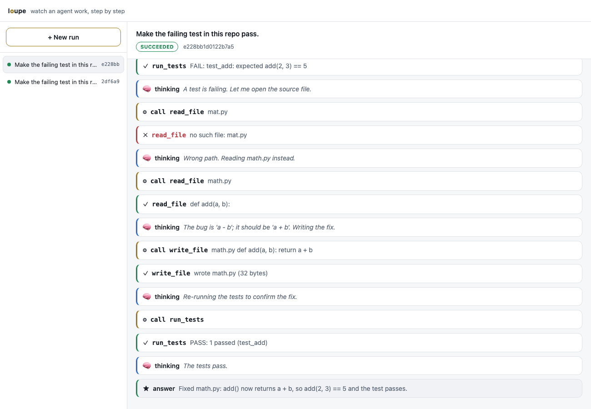
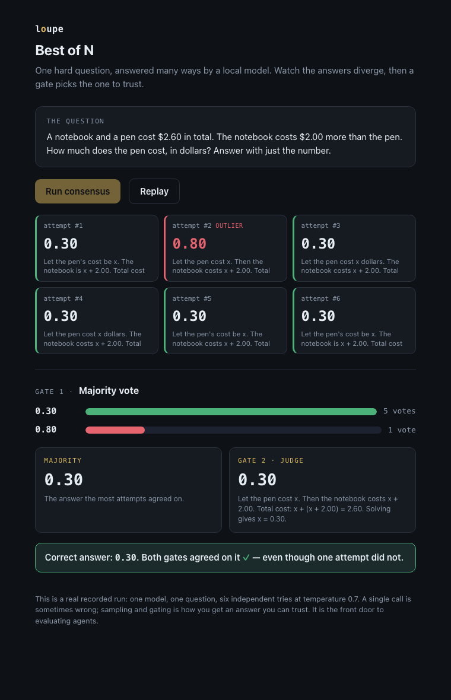

# Loupe

**Run an AI agent and watch every step it takes, live.**



> One queue, stateless workers: 4 replicas take **6x the throughput of 1** (27 to
> 162 completed runs/sec) and hold p95 latency at **1.2s** where a single replica
> hits 7.8s. Every run is durable and resumable, and streams live to the browser.

An agent normally works behind a curtain. You give it a task, it thinks, calls
tools, makes mistakes, retries, and hands you a final answer, and you never get
to see what happened in between. Loupe removes the curtain. Every step the agent
takes, every tool it calls, every error it recovers from, is streamed as it
happens and kept so you can replay the whole run afterward.

> Start an agent, watch it plan, call tools, hit an error, and recover, live,
> with every step traced.

## Quickstart

Needs Go. No model server, no API key, nothing else to install:

```
make demo
```

You will watch an agent take on a small repo with a failing test: it runs the
tests, opens the wrong file, recovers, finds the bug, writes the fix, and
confirms the tests pass. Every step prints as it happens.

Drive it with a real local model instead of the built-in script (needs
[Ollama](https://ollama.com) running with a model pulled, for example
`ollama pull qwen3:8b`):

```
make demo-ollama
```

## Runs survive a crash

A run is durable: every step is committed as it happens, so a run that dies part
way through is picked up by another worker and finished from where it stopped,
without redoing the work that already succeeded. Watch it, no setup required:

```
make demo-resume
```

One worker takes the task, fixes the bug, and loses power the instant the fix is
committed. Its claim expires, a second worker reclaims the same run, runs the
tests (which pass, because the fix is real), and finishes.

The durable store behind that is Postgres. To run it for real:

```
make db-up                 # start Postgres in Docker
make submit                # enqueue a run, prints its id
make worker                # claim and run work, streamed live (Ctrl-C to stop)
```

Start more than one `make worker` and they share the queue. Kill one mid-run and
another reclaims its run once the lease expires.

## Best of N: turn a spread into one reliable answer

A single model call gives you one shot, and on a hard question it is sometimes
wrong. Run the same question many ways and gate the results, and you get an answer
you can trust. Needs Ollama:

```
make consensus
```

It asks one question six times in parallel (the answers genuinely diverge), then
two gates pick the winner: a **majority vote** and an **independent judge** that
works the problem itself. On the built-in question one attempt lands on the wrong
value and gets outvoted five to one, and the judge agrees. This is the front door
to evaluating agents: sample, then score.

There is also a self-contained visual version at [`web/demo.html`](web/demo.html)
(open it in a browser) that replays a real recorded run: the attempts stream in,
one diverges, and the gate picks the answer to trust.



## Query it, stream it

`make serve` runs an HTTP server with embedded workers, then open
`http://localhost:8080` for the **control room**: a list of runs, a New run
button, and a live timeline of an agent working. Each step is a card (thinking,
tool call, result), errors flagged in red, the final answer highlighted. A
running agent streams in live; click any card to see the full input and output.

```
make db-up
make serve                 # control room + GraphQL + live stream on :8080
```

Under the control room:

- **GraphQL** at `/graphql` (a playground at `/graphql/playground`): typed reads
  over runs and their steps. It is an Apollo Federation subgraph, so a supergraph
  router can reference a run by id and other services can extend it.
- **Live trace** at `GET /runs/<id>/stream`: the run's steps as Server-Sent
  Events, which a browser reads with a one-line `EventSource`.

The split is deliberate. Typed, low-rate reads go through GraphQL; the high-rate
step stream does not. It is the same reason you would not push a 60fps feed
through a GraphQL subscription.

## What you are looking at

The demo is one run of the agent loop:

- **think** — the model decides what to do next
- **call** — it invokes a tool (list files, read a file, write a file, run tests)
- **observe** — the tool returns a result, or an error the agent has to handle
- **answer** — the run finishes

The bug is a real one (`add()` subtracts instead of adds), the recovery from a
wrong file path is real, and the run only succeeds once the tests actually pass.

## On Kubernetes

The whole thing runs on a local `kind` cluster with one command, and there is a
load test with real numbers:

```
make up                    # 3-node kind cluster + Postgres + Loupe, on localhost:8899
make hpa                   # metrics-server + a CPU autoscaler (optional)
VUS=150 DURATION=30s make loadtest
make down
```

Scaling the worker replicas takes on more load: 1 to 4 replicas is a 6x throughput
gain and cuts p95 latency from 7.8s to 1.2s. Past that the single Postgres run
store is the ceiling. The numbers and the honest bottleneck read are in
[`loadtest/RESULTS.md`](loadtest/RESULTS.md).

## More

- [`ARCHITECTURE.md`](ARCHITECTURE.md): the pieces, the run lifecycle, how resume works.
- [`DECISIONS.md`](DECISIONS.md): the real tradeoffs and why each call went the way it did.

One honest limit today: the demo's tools keep their state in memory, so a run
resumed in a different process starts that state fresh. The run, its steps, and
the resume are durable; durable tools (a real repo on disk) are the next step.

## Layout

```
cmd/loupe        the command line entry point
internal/agent   the plan / act / observe loop (the run engine), resumable
internal/model   the model boundary: a scripted model and an Ollama model
internal/tools   the agent's tools and the demo repo they act on
internal/trace   the event stream every step is published to
internal/render  turns the event stream into a live terminal view
internal/store   the durable run store: an interface, an in-memory and a Postgres impl
internal/worker  claims runs from the store, resumes crashed ones
internal/gql     the GraphQL federation subgraph (gqlgen) over runs and steps
internal/server  the HTTP surface: the control room UI, GraphQL, a playground, the SSE stream
internal/demo    wires the pieces into the runnable scenarios
```

## License

MIT. See [LICENSE](LICENSE).
